class: center, middle, cover-slide
background-image: url(./figures/bg.jpg)
background-position: 50% 50%
background-size: cover

```{r setup, include=FALSE}
options(htmltools.dir.version =FALSE)
knitr::opts_chunk$set(echo = TRUE, fig.align = "center")
```


### 利用RMarkdown快速实现定制化报表

#### 跨越速运 数据挖掘专家
#### 谢佳标

##### 2018/11/24

---
class: inverse,middle,center
# 基础篇

---
### 学习必备
+ [rstudio](https://rmarkdown.rstudio.com/)

+ [Elegant, flexible, and fast dynamic report generation with R](https://yihui.name/knitr/)

+ [R Markdown: The Definitive Guide](https://bookdown.org/yihui/rmarkdown/)

+ [RStudio Webinars](https://resources.rstudio.com/webinars)

+ [Code and slides for RStudio webinars](https://github.com/rstudio/webinars)

---
### 输出格式

.pull-left[

+ html_document

+ pdf_document

+ word_document

+ md_document

+ beamer_presentation

+ ioslides_presentation

+ slidy_presentation

+ powerpoint_presentation

]

.pull-right[

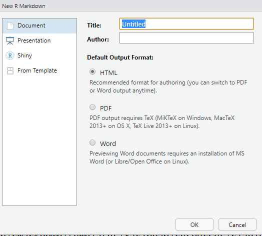

]

---
### 文档模板
+ `xaringan`、 `tufte`、`rticles`、`mosaic`等扩展包提供了丰富的文档模板 

+ 本文档使用xaringan包文档模板撰写

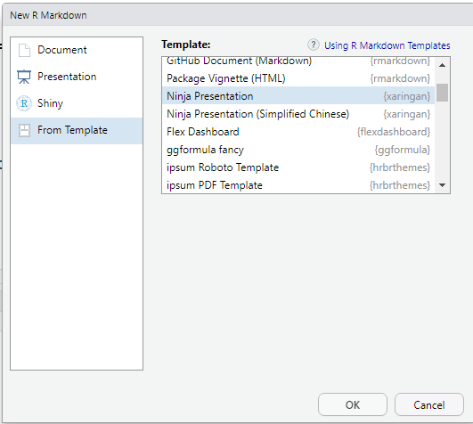

---
### 模板样例

.pull-left[
```yaml
---
title: "Untitled"
output: 
  flexdashboard::flex_dashboard:
    orientation: columns
    vertical_layout: fill
---
```
]

.pull-right[
```{r,echo = FALSE}
knitr::include_graphics('./figures/picture3.png', dpi = NA)
```
]

---
### 插入静态图片

.pull-left[
```markdown

```
```html

```
````md
`r ''````{r,fig.align='center'}
knitr::include_graphics('./figures/company.png', dpi = NA)
```
````
]

.pull-right[
```{r,fig.align='center',echo = FALSE}
knitr::include_graphics('./figures/company.png', dpi = NA)
```
]

---
### 插入GIF动图

+ 与插入静态图片方法类似

.pull-left[
```markdown
.center[]
```
```html

```
````md
`r ''````{r,out.height=80,fig.align='center'}
knitr::include_graphics('./figures/picture4.gif', dpi = NA)
```
````
]

.pull-right[
````{r,fig.align='center',echo = FALSE}
knitr::include_graphics('./figures/picture4.gif', dpi = NA)
```
]

---
### 用R绘制动图-FFmpeg

要嵌入R代码绘制的动图，需要在计算机安装[FFmpeg](https://www.ffmpeg.org/download.html)

.pull-left[
````md
`r ''```{r,fig.show='animate',ffmpeg.format='gif',dev='jpeg'}
for (i in 3:10) {
  clusters <- kmeans(iris[,1:4],i)
  plot(iris[,c('Sepal.Length','Sepal.Width')],
       col = clusters$cluster,pch = 20, cex = 3)
  points(clusters$centers, col = "rosybrown4", cex = 5, pch = "*")
}
```
````
]

.pull-right[
```{r,fig.show='animate',ffmpeg.format='gif',dev='jpeg',echo = FALSE}
for (i in 3:10) {
  clusters <- kmeans(iris[,1:4],i)
  plot(iris[,c('Sepal.Length','Sepal.Width')],
       col = clusters$cluster,pch = 20, cex = 3)
  points(clusters$centers, col = "rosybrown4", cex = 5, pch = "*")
}
```
]

---
### 用R绘制动图-gifski
+ knitr至少版本为1.20
+ 在r代码块选项中设置animation.hook='gifski'

.pull-left[
````md
`r ''```{r,animation.hook='gifski'}
for (i in c(10, 20, 25,30,35,40))   
hist(faithful$eruptions,i,col = 'gray', border = 'white',
      xlab = 'Duration (minutes)')
```
````
]

.pull-right[
```{r,animation.hook='gifski',message = FALSE,echo = FALSE}
for (i in c(10, 20, 25,30,35,40))   
hist(faithful$eruptions,i,col = 'gray', border = 'white',
      xlab = 'Duration (minutes)')
```
]

---
### 交互图-htmlwidgets 
````md
`r ''```{r,echo=FALSE,out.width="100%"}
if(!require(timevis)) install.packages("timevis")
data <- data.frame( id = 1:2,
  content = c("第十一届中国R语言会议(广州)"  ,"第十一届中国R语言会议(上海)"),
  start   = c( "2018-11-24", "2018-12-08"),
  end     = c( "2018-11-26", "2018-12-10")
)
timevis(data)
```
````
```{r,echo=FALSE,out.width="100%",message = FALSE,warning = FALSE}
if(!require(timevis)) install.packages("timevis")
data <- data.frame( id = 1:2,
  content = c("第十一届中国R语言会议(广州)"  ,"第十一届中国R语言会议(上海)"),
  start   = c( "2018-11-24", "2018-12-08"),
  end     = c( "2018-11-26", "2018-12-10")
)
timevis(data)
```

---
### 交互图-shiny
在YAML中添加`runtime: shiny`语句

.pull-left[
````YAML
---
title: "Shiny Document"
runtime: shiny
output: html_document
---
````
]

.pull-right[
```{r,fig.align='center',echo = FALSE}
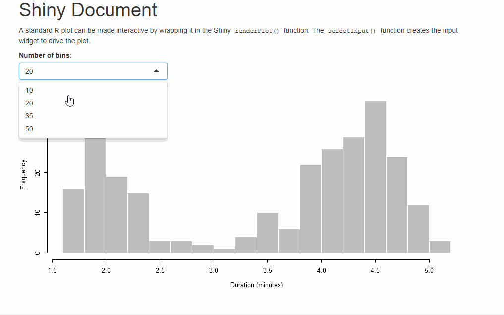
```
]

---
### 交互图-shiny
嵌入写好的shiny应用程序：

.pull-left[
````md
`r ''```{r,echo=FALSE}
shinyAppDir("myapp",options = list(width = "100%", height = 800))
```
````
]

.pull-right[
```{r,fig.align='center',echo = FALSE}
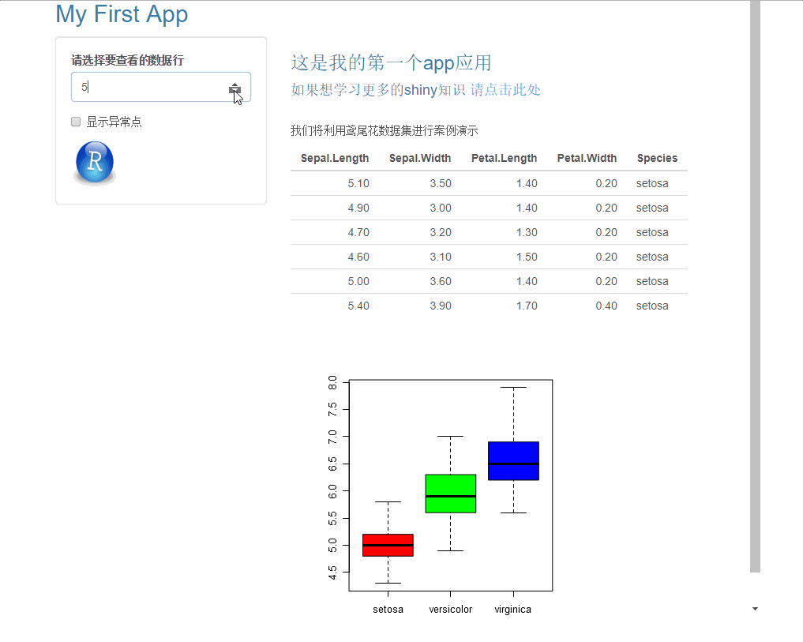
```
]

---
class: inverse,middle,center
# 技巧篇

---
### 支持多种语言
+ RMarkdown还支持许多其他语言，例如Python，Julia，C ++和SQL等

+ 可通过命令`names(knitr::knit_engines$get())`进行查看支持的语言清单

+ 以下是调用python代码实现Kmeans++聚类

```{python}
from sklearn.datasets import load_iris
iris = load_iris()
from sklearn.cluster import KMeans
kmeans = KMeans(n_clusters = 3, init = 'k-means++', random_state = 123)
y_kmeans = kmeans.fit_predict(iris.data)
print(y_kmeans)
```

---
### 插入JavaScript和CSS

在html_document和ioslides_presenation等输格式的文档插入JavaScript和CSS

.pull-left[
````markdown
`r ''````{js, echo=FALSE}
$('.title').css('color', 'red')
```
````

````markdown
`r ''````{css, echo=FALSE}
h1, h2 {
  color: green;
}
h3,h4, h5, h6 {
  color: blue;
}
body {
  color:slategray
}
```
````
]

.pull-right[
```{r,out.width='100%',out.height='100%',fig.align='center',echo = FALSE}
knitr::include_graphics('./figures/js&css1.gif')
```
]

---
### 修改或替换CSS文件

.pull-left[
````yaml
---
title: "R语言常用导入数据函数"
author: "Daniel Xie"
date: "`r format(Sys.time(), '%d %B, %Y')`"
output:
  html_document:
    toc: true
    fig_caption: true
    theme: flatly
    css: styles.css
---
````

````html


````
]

.pull-right[
```{r,fig.align='center',echo = FALSE}
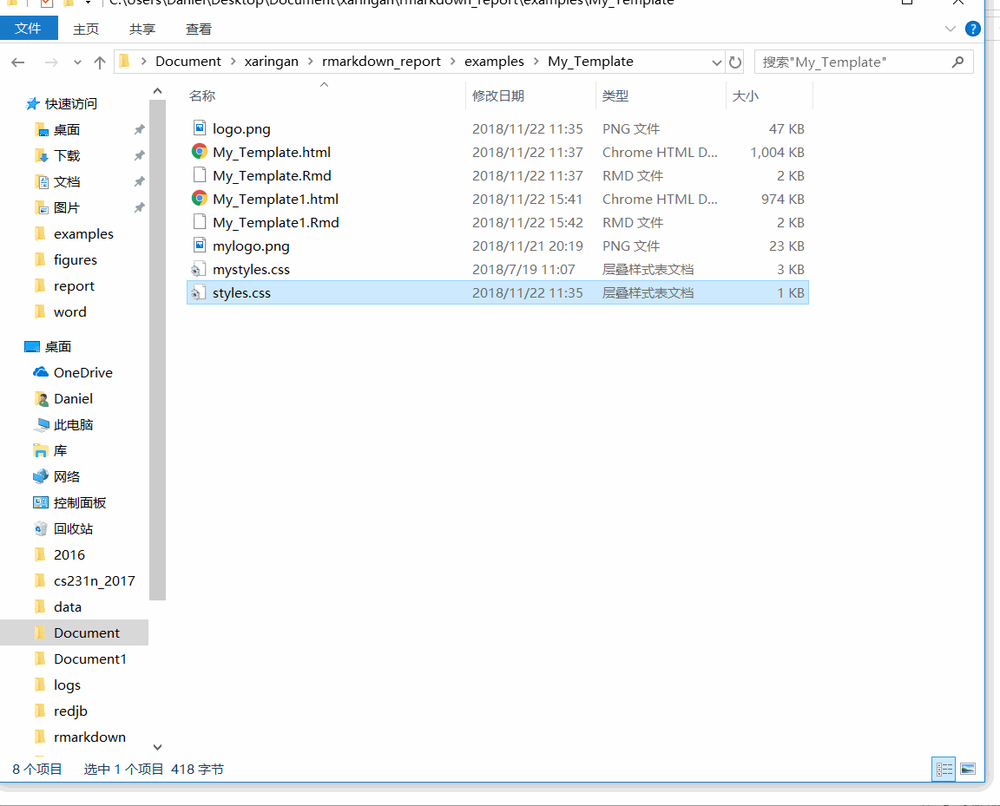
```
]

---
### 创建PPT

要利用R Markdown创建PowerPoint演示文稿，需满足:

+ rmarkdown > = v1.9中可用，并且 Pandoc > = v2.0.5
+ 或安装捆绑了Pandoc 2.x 的[RStudio（> = 1.2.633）](https://www.rstudio.com/products/rstudio/download/preview/)的预览版本

.pull-left[
````yaml
---
title: "PowerPoint"
author: "Daniel Xie"
date: "2018/11/22"
output: powerpoint_presentation
---
````
]

.pull-right[
```{r,fig.align='center',echo = FALSE}
knitr::include_graphics('./figures/powerpoint.gif')
```
]

---
### 修改PPT布局
可通过`:::::: {.columns} ::: {.column} :::
::::::`设置多列布局

.pull-left[
````yaml
:::::: {.columns}
::: {.column width="50%"}
```{r,echo=TRUE,eval = FALSE}
head(women)
```
:::
::: {.column width="50%"}

```{r,eval = FALSE}
plot(women,col="blue",pch = 16,cex = 1.5)
abline(lm(women$weight~women$height),lty=2,lwd=2,col='red')
```
:::
::::::
````
]

.pull-right[
```{r,fig.align='center',echo = FALSE}
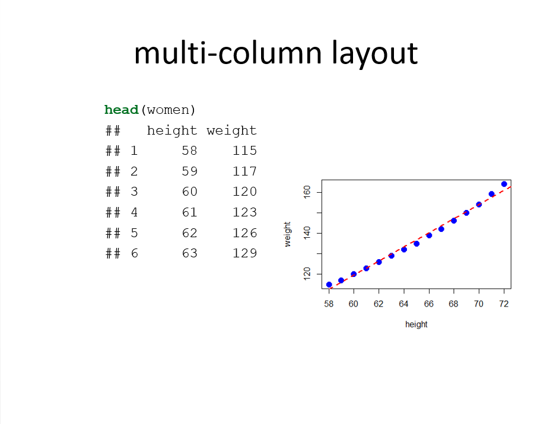
```
]

---
### 自定义PPT模板
可以通过`reference_doc`选项传递自定义模板来修改PowerPoint母版。
.pull-left[
````yaml
---
title: "PowerPoint"
author: "Daniel Xie"
date: "2018/11/22"
output: 
  powerpoint_presentation:
    reference_doc: my-styles.pptx
---
````
]

.pull-right[
```{r,echo = FALSE}
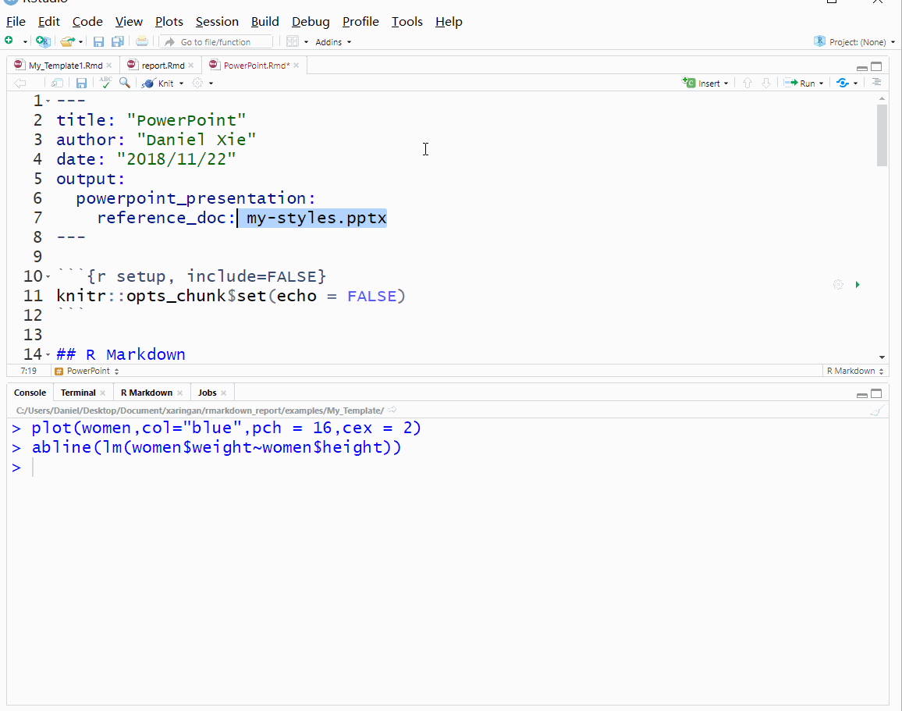
```
]

---
### 仪表盘

可以基于flexdashboard包快速创建仪表盘

+ 使用R Markdown将一组相关数据可视化作为仪表板发布

+ 嵌入各种组件，包括HTML小部件，R图形，表格数据，仪表，值框和文本注释

+ 指定基于行或列的布局

+ 创建故事板

+ 结合Shiny实现交互可视化

---
### 仪表盘-布局

+ 一级`===`生成页，二级`---`生成列（或行）,三级`###`生成框

+ 默认是按列布局，通过`orientation: rows`可设置按行布局，则三级按行排列

+ 除了行列布局，还可以通过`storyboard: true`生成故事板

.pull-left[
````yaml
---
title: "Multiple Pages"
output: flexdashboard::flex_dashboard
---
````

```{r,fig.align='center',echo = FALSE}
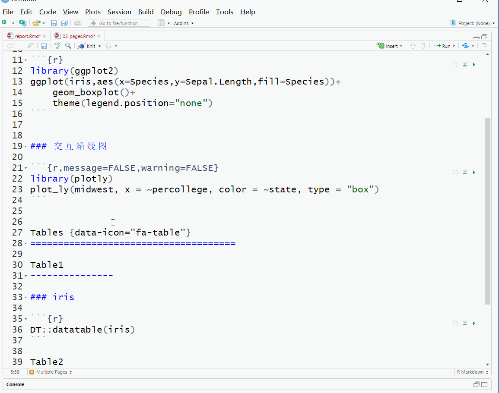
```
]

.pull-right[
````yaml
---
title: "Storyboard Commentary"
output: 
  flexdashboard::flex_dashboard:
    storyboard: true
---
````
```{r,fig.align='center',echo = FALSE}
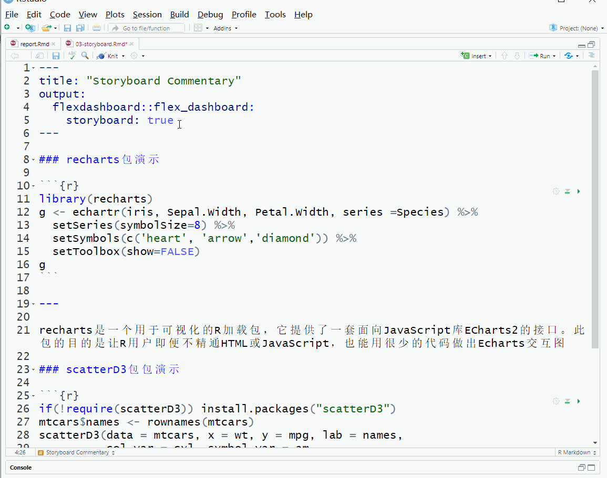
```

]

---
### 仪表盘-组件

+ 价值框：valueBox()函数显示单个值以及标题和可选图标

+ 仪表盘：gauge()功能用于输出仪表。有三个必需参数：value，min和max

+ 文本注释

+ 导航栏：默认情况下，仪表板导航栏包括文档的title，author和date

```{r,fig.align='center',echo = FALSE}
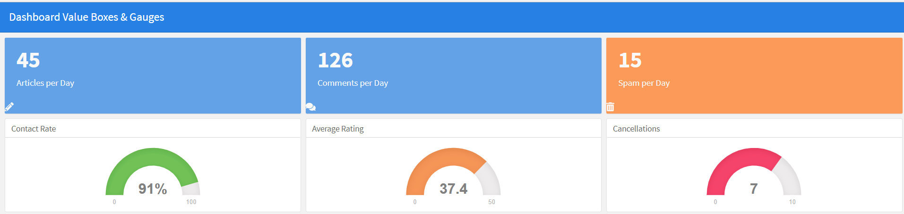
```

---
### 仪表盘-添加shiny

+ 在YAML中添加`runtime: shiny`语句

+ `Column {.sidebar}`可在flexdashboard添加左侧边栏，默认宽度为250像素

.pull-left[
````yaml
---
title: "Old Faithful Eruptions"
output: 
  flexdashboard::flex_dashboard:
    orientation: columns
    social: menu
    source_code: embed
runtime: shiny
---
````
]

.pull-right[
```{r,fig.align='center',echo = FALSE}
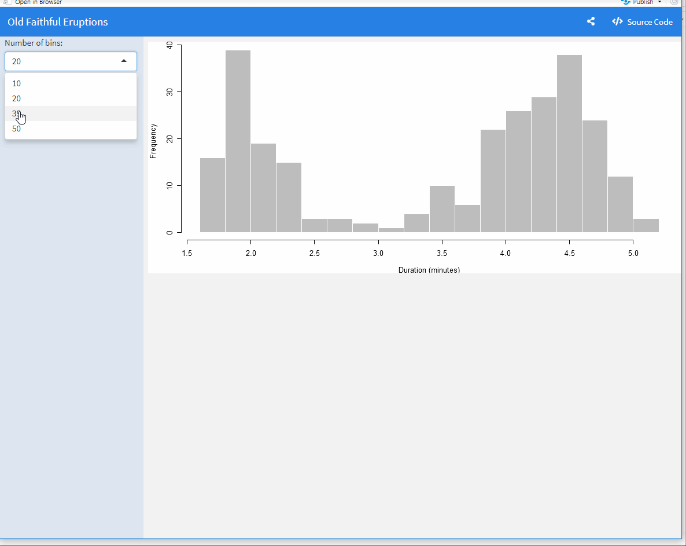
```
]

---
### Demo

本实例对[《R语言游戏数据分析与挖掘》](https://item.jd.com/12128645.html)一书中的shiny篇案例进行改造

```{r,fig.align='center',echo = FALSE}
knitr::include_graphics('./figures/Data_Visualization.gif')
```
